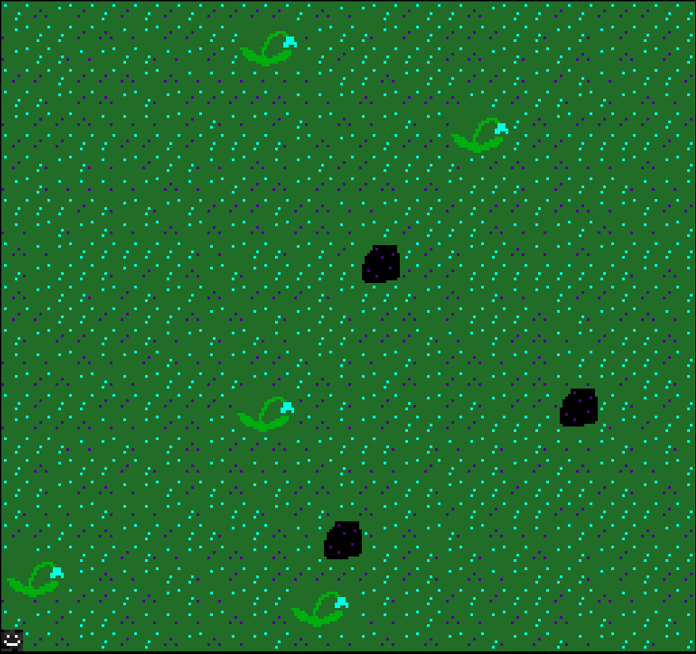

# Eat the world

Author: Matteo Jeulin (mjeulin)

Design: Eat the world is a fast paced mini game with randomly generated levels

Screen Shot:

How Your Asset Pipeline Works:

My asset pipeline takes a PPM file (with no comments inside) and reads it in 8x8 chunks. The file dimensions should be multiples of 8 to ensure proper parsing. The chunks are read one after the other. On the first pass through a chunk, a colour palette of the chunk is constructed. This palette is then checked to see if a similar one has already been registered. If not, a new palette is added to our palette table. During the second pass, the tile representation of the chunk is constructed. This tile is then added to the tile table. 
Finally, a tile reference is created for the tile containing an index to the palette containing the colours to draw it and an index to its tile representation in the tile table. It also contains its position (in chunks) relative to the bottom left tile in its sprite. The tile table and palette table are stored in parsing/tables.ppu using the write_chunk function and all the tile refs have their own .ppu file (one file per sprite so a single file can contain multiple tile refs) in the parsing/sprites directory.
When a GameMode is created, the tile table and palette table are loaded to the PPU and some useful sprites are loaded to the sprite table using read_chunk.

All the source file drawings can be found in the sprites folder. 

How To Play:

The character moves with the arrow keys. The goal of the game is to eat all the flowers before dying. When the player spawns, a death timer starts. This timer can be partially refreshed by walking into a void puddle. If you lose, you will go back to the void where you belong. Press space to restart the game. If you win a round, another harder one immediatly starts.

This game was built with [NEST](NEST.md).

